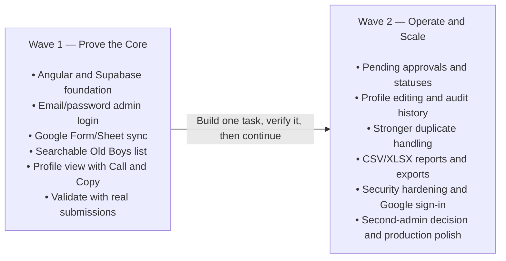
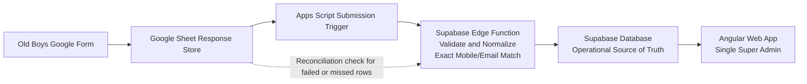

# Old Boys Digital Diary

## Lean MVP Development Plan

**Technology:** Angular Web App + Supabase + Google Forms / Sheets Integration

| **Delivery approach** | Two waves, one verified task at a time              |
|-----------------------|-----------------------------------------------------|
| **MVP user**          | Single Super Admin                                  |
| **Wave 1 goal**       | Collect, sync, search and view real member data     |
| **Wave 2 goal**       | Approve, edit, audit, export and harden             |
| **Document style**    | Functional ideas only — no code-level specification |
| **Page limit**        | Maximum 12 pages                                    |

> **Main principle:** Build the shortest path to a working directory first. Use real submissions to guide the approval, duplicate and reporting features added later.

**Version:** 2.0 — Updated phased plan

# 1 Purpose, Scope and Core Decisions

This plan defines a lean first release for managing School Old Boys contact data. It adopts a two-wave approach so the core data flow is proven before operational workflows and reporting are added.

## Business Goal

- Old Boys submit their details through a Google Form.

- New submissions reach the Supabase database automatically and appear in the admin web app.

- The Super Admin can search and filter members by name, batch number, mobile number, profession and other useful fields.

- Each member has a profile page with direct Call and Copy Number actions.

- Later, the system adds approvals, editing, audit history, exports and additional admin capacity.

## Confirmed Technology Direction

| **Area**             | **Decision**                                                                                                                    |
|----------------------|---------------------------------------------------------------------------------------------------------------------------------|
| Frontend             | Angular responsive web application, suitable for desktop and mobile browsers.                                                   |
| Backend and database | Supabase: PostgreSQL database, authentication, server-side functions and security controls.                                     |
| Data collection      | Google Form connected to a Google Sheet.                                                                                        |
| Data synchronization | Google Apps Script sends each new submission to a protected Supabase Edge Function. A reconciliation check handles missed rows. |
| Hosting              | Spaceship hosting for the production Angular build after Wave 1 is proven.                                                      |
| Primary user         | One Super Admin in the MVP. No public or Old Boy member login.                                                                  |

## Day-One Scope Cuts

- No profile photo upload. This avoids storage, privacy and permission complexity.

- No PDF export. CSV and XLSX will be added in Wave 2 and cover the practical need.

- No fuzzy name matching in the first build. Initial duplicate checks use exact normalized mobile and exact email only.

- No Google sign-in in Wave 1. Use email/password with password recovery sent to the admin Gmail address.

- No approval, verification, deactivation or detailed audit workflow until real submissions have proven the core flow.

> **Important operating assumption:** Wave 1 data is visible only to the Super Admin. Therefore, newly imported records can appear immediately without creating a public privacy risk.

# 2 Two-Wave Delivery Roadmap

## Wave 1 — Core Directory

| **Outcome**           | **Included**                                                                               |
|-----------------------|--------------------------------------------------------------------------------------------|
| Working foundation    | Angular application, Supabase project, database structure and single-admin authentication. |
| Reliable intake       | Google Form/Sheet submission sent to Supabase through Apps Script and an Edge Function.    |
| Searchable directory  | Old Boys list with search, filters, sorting and basic pagination.                          |
| Useful profile        | Single profile view with member details, Call and Copy Number.                             |
| Real-world validation | Test with actual or representative submissions before designing heavier workflows.         |

## Wave 1 Exit Decision

- At least several real form submissions have synced successfully without duplicate insertion.

- The admin can quickly find a member by name, batch, mobile and profession.

- The profile is comfortable to use on both phone and desktop.

- The team has observed actual data quality problems and can make informed Wave 2 decisions.

## Wave 2 — Operations and Scale

- Pending approvals, verification, rejection, duplicate review, deactivation and reactivation.

- Profile editing with a clear audit trail.

- Filtered CSV/XLSX exports and summary reports.

- Security hardening, Google sign-in option, production deployment polish and backup procedures.

- Decision on adding a second administrator or batch representatives.

# 3 Lean Solution Architecture

## Data Flow

1.  An Old Boy completes the Google Form.

2.  Google stores the response in the linked Sheet.

3.  An Apps Script submission trigger sends the new row to a protected Supabase Edge Function.

4.  The Edge Function validates the request, normalizes key fields and checks exact mobile/email matches.

5.  The record is inserted once into Supabase and becomes available to the Angular web app.

6.  A reconciliation process checks unsynced or failed Sheet rows and safely retries them.

## Source of Truth

After import, Supabase becomes the operational source of truth. The Google Sheet remains the original intake record and recovery reference. Admin edits in Wave 2 are made in the web app, not directly in the Sheet.

## Near-Real-Time Meaning

The normal path should make a new submission visible within seconds. The system should still tolerate internet or temporary service failures by recording sync status and retrying later.

## Why This Architecture Fits the MVP

- Old Boys use a familiar Google Form and require no account.

- The public form never receives direct database credentials.

- Supabase handles structured data, authentication and access protection in one platform.

- Angular provides a responsive admin interface suitable for future expansion.

- Each part can be tested independently before moving to the next task.

# 4 Wave 1 Functional Plan

## 4.1 Login and Password Recovery

- Provide a simple email/password login for the Super Admin.

- Do not show public registration or account creation.

- Use the administrator Gmail address as the account email.

- Forgot Password sends a secure recovery link to that Gmail inbox.

- After login, all application pages remain protected from unauthenticated access.

## 4.2 All Old Boys List

| **Capability** | **Wave 1 Behaviour**                                                                        |
|----------------|---------------------------------------------------------------------------------------------|
| Display        | Responsive table on desktop and practical cards or scrollable rows on mobile.               |
| Search         | One search box covering name, batch, mobile, email, profession, company and location.       |
| Filters        | Batch, profession, country/city and submission date. Add only filters that real users need. |
| Sort           | Newest submission, oldest submission, name and batch.                                       |
| Pagination     | Load records in manageable pages rather than downloading the full database.                 |
| Open profile   | Click a row or card to open the single member profile.                                      |

## 4.3 Single Old Boy Profile

- Show full name, batch, admission number if collected, mobile, WhatsApp, email, profession, company, city/country, address and submission information.

- Call opens the phone dialler on supported mobile devices.

- Copy Number places the selected number on the clipboard and confirms the action.

- On desktop, the number remains easy to copy even when no calling application is available.

- Wave 1 intentionally excludes edit, verify and deactivate actions.

## 4.4 Google Form Fields

| **Required**                  | **Optional**      |
|-------------------------------|-------------------|
| Full name                     | Admission number  |
| Batch number/year             | WhatsApp number   |
| Primary mobile                | Email             |
| Profession                    | Company/workplace |
| Current country or city       | Postal address    |
| Consent/accuracy confirmation | Additional notes  |

> **Form rule:** Keep the form short enough that Old Boys complete it. Collect only information the association will genuinely use.

# 5 Wave 2 Functional Plan

## 5.1 Approval and Status Workflow

- Introduce clear statuses such as Pending, Verified, Inactive, Rejected and Possible Duplicate.

- New submissions enter Pending once the workflow is enabled.

- The Pending Approvals page shows the oldest unreviewed records first.

- The Super Admin can verify, reject, mark as duplicate, deactivate or reactivate with confirmation.

- Status changes record who performed the action and when.

## 5.2 Edit Profile and Audit History

- Allow the Super Admin to correct member data from the profile page.

- Validate mobile, email and required fields before saving.

- Show a warning when the changed mobile or email matches another record.

- Keep an audit history showing the changed fields, previous values, new values, administrator and time.

- Avoid permanent deletion during normal use; deactivate records instead.

## 5.3 Duplicate Handling

| **Stage**            | **Rule**                                                                                                |
|----------------------|---------------------------------------------------------------------------------------------------------|
| Wave 1               | Flag exact normalized mobile match or exact normalized email match. Do not automatically merge records. |
| Wave 2               | Provide side-by-side review, merge decisions and clearer reasons for duplicate risk.                    |
| Later only if needed | Consider fuzzy name + batch matching after real data shows that exact rules are insufficient.           |

## 5.4 Reports and Exports

- Export the complete current filtered result set, not only the visible page.

- Support CSV and XLSX. Preserve phone numbers as text so leading zeros are not lost.

- Allow the admin to choose which fields to include.

- Provide basic summaries by batch, profession, country and member status.

- Do not build PDF export unless a confirmed business need appears.

## 5.5 Additional Administration

- Optional Google sign-in for the allowlisted admin email.

- Second Super Admin or Batch Admin role if the review workload becomes too large.

- Production release checklist, backup ownership, monitoring and support procedures.

# 6 Data, Security and Operations

## Conceptual Data Areas

| **Data area**           | **Purpose**                                                      |
|-------------------------|------------------------------------------------------------------|
| Old Boys                | Main member information, source details and later status fields. |
| Admin Users             | Allowlisted administrator accounts and future roles.             |
| Sync Records            | Submission result, retry status and troubleshooting information. |
| Audit Records — Wave 2  | Profile and status changes made by administrators.               |
| Export Records — Wave 2 | Who exported, which filters were used, format and row count.     |

## Security Principles

- No public access to Old Boys records.

- No open sign-up. Only explicitly approved admin accounts can enter the system.

- Database service credentials and webhook secrets stay server-side and are never placed in the Angular application.

- Supabase access policies must protect each table, not only the visible web pages.

- Use HTTPS for the production domain and approved authentication redirect URLs.

- Collect the minimum personal information necessary and keep exports controlled.

## Single-Admin Workload Decision

A single Super Admin is suitable for proving the system, but 5,000+ records can create an operational bottleneck. Before Wave 2 is completed, choose one of these models:

| **Option**                    | **Practical meaning**                                                                                                         |
|-------------------------------|-------------------------------------------------------------------------------------------------------------------------------|
| Remain single-admin           | Batch representatives send corrections or approval recommendations outside the system. The Super Admin remains the only user. |
| Add a second admin            | Another trusted administrator shares the review queue. This is the simplest operational expansion.                            |
| Add scoped batch admins later | Batch representatives manage only their own batch. This requires stronger permissions and should be a later enhancement.      |

## Operational Basics

- Review failed sync rows and retry them.

- Keep periodic database exports or backups under association control.

- Document who owns the Google Form, Sheet, Supabase project, domain and admin email.

- Rotate shared secrets when responsibility changes or exposure is suspected.

# 7 Antigravity Implementation Sequence

Give Google Antigravity one task at a time. Review the result, run the application, confirm the completion check and only then provide the next task. Do not send the full plan as a single build prompt.

## Wave 1 Tasks

| **Task**                    | **Objective**                                                                     | **Completion Check**                                                                            |
|-----------------------------|-----------------------------------------------------------------------------------|-------------------------------------------------------------------------------------------------|
| 01 — Angular scaffold       | Create the responsive project shell, navigation and placeholder pages.            | Application builds and the main routes open.                                                    |
| 02 — Supabase foundation    | Create the initial database structure and protected admin data model.             | Database setup is repeatable and accessible only as intended.                                   |
| 03 — Admin authentication   | Implement email/password login, logout and Gmail password recovery.               | Admin can sign in, reset password and protected pages reject other users.                       |
| 04 — Supabase sync endpoint | Create the protected server-side intake point for Google submissions.             | A valid test submission creates one record; invalid/repeated requests do not create duplicates. |
| 05 — Google Form/Sheet sync | Connect the Form/Sheet trigger, status feedback and retry/reconciliation process. | A form submission appears in Supabase and failed rows can be retried safely.                    |
| 06 — Old Boys list          | Build search, filters, sorting, pagination and responsive display.                | Admin can locate real records quickly by core fields.                                           |
| 07 — Profile view           | Build the profile page with Call and Copy Number.                                 | Profile works on phone and desktop using real synced data.                                      |

## Wave 2 Tasks

| **Task**                          | **Objective**                                                                                                                      |
|-----------------------------------|------------------------------------------------------------------------------------------------------------------------------------|
| 08 — Approval and profile editing | Add statuses, Pending Approvals, verify/deactivate actions, editing and audit history.                                             |
| 09 — Duplicate review             | Improve exact-match warnings and add human-controlled comparison/merge decisions.                                                  |
| 10 — Reports and exports          | Add shared filters, summaries and CSV/XLSX export.                                                                                 |
| 11 — Security and admin expansion | Complete hardening, optional Google sign-in and the chosen second-admin approach.                                                  |
| 12 — Production release           | Deploy and polish the Angular application on Spaceship, configure domain routing, complete smoke tests and handover documentation. |

> **Immediate next step:** Start with Task 01 only. Verify the Angular project builds correctly before asking the IDE to create Task 02.

# 8 Testing and Acceptance

## Wave 1 Acceptance Criteria

- The allowlisted Super Admin can log in and all other unauthenticated users are blocked.

- Password recovery reaches the administrator Gmail inbox and permits a secure password change.

- Each Google Form submission creates one and only one Supabase record.

- Temporary sync failures are visible and can be retried without duplicate insertion.

- Search and filters work for name, batch, mobile and profession using server-side data loading.

- The profile page shows the correct member information.

- Call opens the dialler on supported phones and Copy Number works on phone and desktop.

- The interface is usable on common mobile and desktop screen sizes.

- No database service key or webhook secret is visible in the browser application or public repository.

## Wave 2 Acceptance Criteria

- Pending records can be reviewed, verified, rejected, marked duplicate, deactivated and reactivated.

- Profile edits create a reliable audit history.

- Exact mobile/email duplicate warnings are clear and do not auto-merge records.

- CSV/XLSX export contains every record matching the current filters and preserves mobile numbers correctly.

- The chosen admin model works without allowing access beyond intended records.

- Refreshing any Angular route on Spaceship loads the correct screen rather than a hosting 404.

- Backup, ownership and recovery information is documented.

## Definition of Done for Every Task

| **Check**        | **Meaning**                                                                 |
|------------------|-----------------------------------------------------------------------------|
| Build            | The application or database change runs successfully.                       |
| Behaviour        | The stated completion check is demonstrated with realistic data.            |
| Security         | No shortcut weakens authentication, permissions or secret handling.         |
| Responsive use   | Relevant screens work on desktop and phone.                                 |
| Failure handling | Loading, empty, validation and error states are understandable.             |
| Handover         | The task leaves brief setup notes for the next task and future maintenance. |

# 9 Final Decisions and Future Backlog

## Approved MVP Decisions

| **Decision**                             | **Reason**                                                                                  |
|------------------------------------------|---------------------------------------------------------------------------------------------|
| Two waves instead of one large build     | Reduces risk and gets a useful directory working sooner.                                    |
| One Antigravity task at a time           | Makes errors easier to identify and prevents the agent from expanding scope.                |
| Email/password first                     | Simplest reliable path; Gmail can receive password recovery without Google OAuth.           |
| No profile photos initially              | Avoids storage, consent and access-control complexity for low immediate value.              |
| Exact mobile/email duplicate rules first | Easy to explain and test; real data will show whether fuzzy matching is needed.             |
| CSV/XLSX only                            | Covers practical administration; PDF is optional polish.                                    |
| Supabase as operational source of truth  | The web app can safely manage edits and future workflows without changing the intake Sheet. |

## Future Backlog — Not Part of This Plan

- Old Boy member login and self-service profile updates.

- Batch Admin, Committee Member and detailed role permissions.

- Profile photos, digital member cards and QR verification.

- Events, donations, membership fees, announcements and job opportunities.

- WhatsApp Business campaigns and notification templates.

- Public or member-only directory visibility controls.

- Native mobile applications or offline capability.

- Advanced fuzzy duplicate matching and two-way Google Sheet synchronization.

## Recommended Project Start

1. Confirm the final Google Form questions and administrator Gmail address.

2. Create a clean project folder/repository and give Antigravity Task 01 only.

3. Run the Angular project locally and verify the agreed navigation shell.

4. Continue to Task 02 only after Task 01 is stable.

5. Complete all Wave 1 tasks, test with real submissions, then review the Wave 2 scope before building it.

> **Success definition:** Wave 1 is successful when an Old Boy submits a form and the Super Admin can find that person and use the profile within a few moments. Everything else should support that core outcome.
